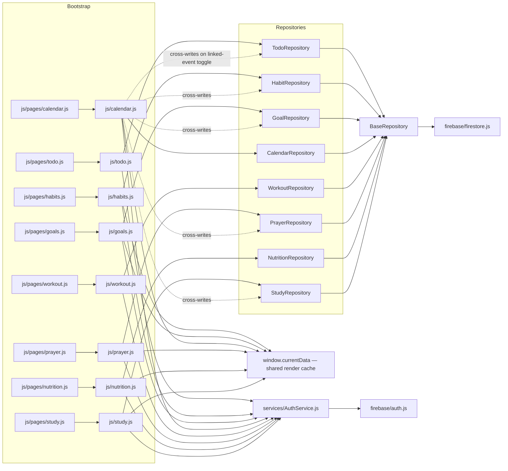
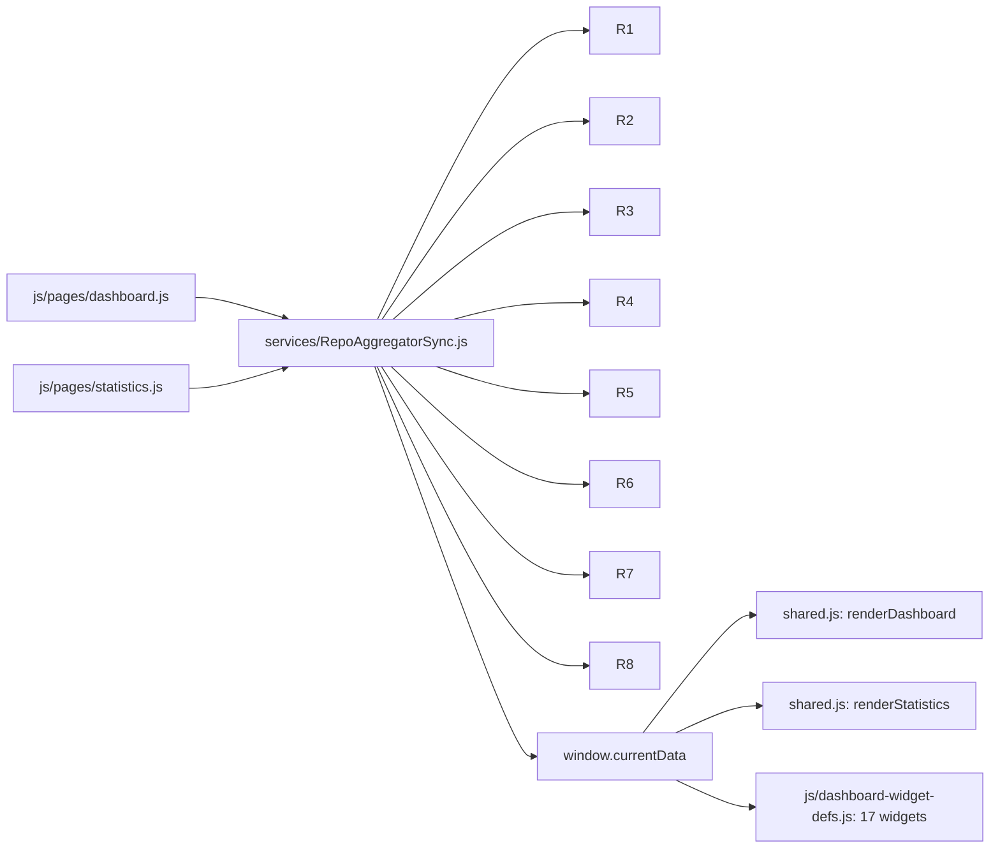
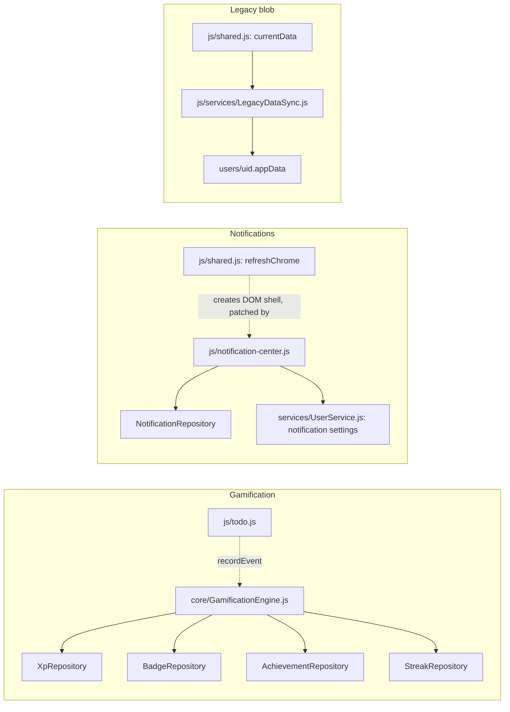

# DEPENDENCY_GRAPH.md — Phase 2

A real dependency map of the current architecture, built from actual `import` statements (not assumed), so it reflects the codebase as it exists after Phases 1–2.

## Page → data layer (the 8 migrated features)

Every one of these follows the identical shape: `js/pages/X.js` (bootstrap) → `js/X.js` (page logic module) → its own repository → Firestore, with `AuthService` supplying the UID and `window.currentData` as the shared render cache.

**Calendar (`js/calendar.js`) is the one node with fan-out beyond its own repository** — toggling a linked event's completion also writes into Todo/Habit/Goal/Prayer/Study's own repositories (dotted lines above). This is intentional (keeping the source-of-truth in sync when a mirrored event is checked off from the Calendar view), not a duplication.

## Dashboard & Statistics (read-only aggregation)

Both Dashboard and Statistics subscribe to all 8 repositories directly via the same shared module — this is the fix from an earlier session that resolved the "Dashboard shows stale data" bug. One aggregation path, not two.

## Cross-cutting systems

**Known real gaps in this graph** (documented in earlier sessions, not re-litigated here):
- Account/Profile page (`js/pages/account.js`) reads/writes achievements and XP through the **legacy blob**, not through `GamificationEngine`'s repositories — a confirmed split-brain, not shown as a connection above because there isn't one; that's the bug.
- Settings' notification-preference toggles write to the legacy blob's `notifications` field, which `notification-center.js` never reads (it reads `UserService`'s `notificationSettings` instead) — same situation.

## What still depends on the legacy `appData` blob

Everything NOT in the 8-feature list above: Profile, Settings, Security, Achievements (display only — see gap above), XP (display only), Quran progress/bookmarks/favorites, Tasbeeh, Hadith collection, Water, Sleep, Body measurements, Progress photos, Shopping list, Workout plan/schedule (as opposed to the log, which is migrated), Study's Subjects/Assignments/Exams/Projects/Notes/Resources/Pomodoro.

## Orphaned nodes (confirmed zero inbound edges from any live page)

- `repositories/StatisticsRepository.js` → only referenced by `repositories/DashboardRepository.js`
- `repositories/DashboardRepository.js` → zero inbound edges from anywhere
- `utils/LocalStorageService.js` → zero inbound edges
- `css/space-video.css`, `css/momentum-theme.css`, `css/momentum-layout.css` → zero inbound edges (not JS, but same orphan status)

No circular imports were found in this pass — every dependency arrow above points one direction only.
