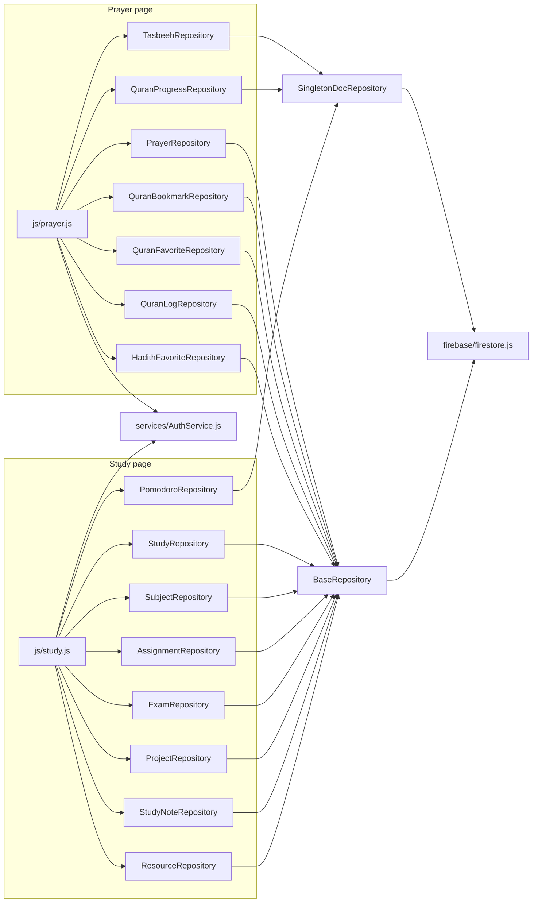

# REPOSITORY_DEPENDENCY_GRAPH.md

## New this phase

`SingletonDocRepository` and `BaseRepository` are siblings (both used by different repositories above), not a hierarchy — `SingletonDocRepository` does not extend `BaseRepository`, per the reasoning in PHASE5_REPOSITORY_REPORT.md.

## Full current repository count: 35

All 35 ultimately depend on the same two primitives: `firebase/firestore.js` (Firestore SDK wrapper) and `services/AuthService.js` (UID resolution via `waitUntilReady()`). No repository talks to Firestore directly without going through `firebase/firestore.js`, and no page resolves a UID without going through `AuthService`. Confirmed by grep across all 35 files — every one imports exactly these two dependencies (plus, for the 22 `BaseRepository`/`SingletonDocRepository` subclasses, their respective base class) and nothing else external.

## No circular dependencies

Same check as every prior phase's dependency graph — every arrow points one direction, base classes never import their own subclasses, pages never get imported by repositories.

## What still points at the legacy system instead of a repository

`js/pages/account.js`, `js/workout.js` (plan/schedule/photos portions only — the log portion points at `WorkoutRepository`), `js/pages/weather.js`, `js/weather-dashboard.js`, `js/services/WeatherRecommendationService.js` — all still importing/calling `persist()`/reading `currentData` directly for their respective still-legacy domains, exactly as catalogued in FINAL_MIGRATION_STATUS.md.
